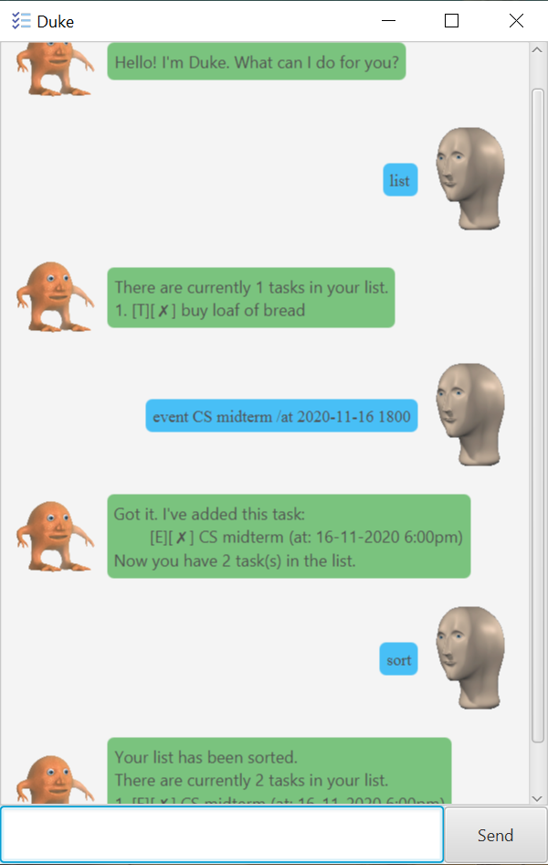

# Duke User Guide

## User Interface



## Features

### Task Management

Duke provides effective management of daily tasks by allowing users to create, update, delete, search and even sort various daily tasks. 

## Usage

1. `todo` 

The `todo` command allows users to create new todo tasks (labelled "T") that do not have a set date.

### Command Format: 

`todo <task_description>`

### Example Usage:

`todo buy bread`

### Expected Outcome:

```
Got it. I've added this task:
    [T][X] buy bread
Now you have 4 task(s) in the list.
```

2. `event` 

The `event` command allows users to create new event tasks (labelled "E") that have an associated start date and time. 

### Command Format: 

`event <event_description> /at <yyyy-MM-dd HHmm>`

### Example Usage:

`event midterm exam /at 2020-05-31 1200`

### Expected Outcome:

```
Got it. I've added this task:
    [E][X] midterm exam (at: 31-05-2020 12:00PM)
Now you have 5 task(s) in the list.
```

3. `deadline`

The `deadline` command allows users to create new tasks (labelled "D") that have an associated deadline (both date and time).

### Command Format:

`deadline <deadline_description> /by <yyyy-MM-dd HHmm>`

### Example Usage:

`deadline submit draft /by 2020-09-17 1400`

### Expected Outcome:

```
Got it. I've added this task:
    [D][X] submit draft (by: 17-09-2020 2:00PM)
Now you have 6 task(s) in the list.
```

4. `done`

The `done` command allows users to mark existing uncompleted tasks as completed. 

### Command Format:

`done <position_of_task_to_mark>`

### Example Usage:

`done 4`

Expected outcome:

```
Nice! I've marked this task as done:
    [T][O] buy bread
```

5. `delete`

The `delete` command allows users to delete existing tasks. 

### Command Format:

`delete <position_of_task_to_delete>`

### Example Usage:

`delete 3`

### Expected outcome:

```
Noted. I've removed this task:
    [D][X] CS assignment (by: 04-08-2020 11:59PM)
Now you have 5 task(s) in the list.
```

6. `list`

The `list` command allows users to view all their current tasks (both pending and completed) in a list format.

### Command Format:

`list`

### Example Usage:

`list`

### Expected Outcome:

```
There are currently 5 tasks in your list.
1. [T][O] return book
2. [E][O] study session (at: 02-05-2020 6:00PM)
3. [T][O] buy bread
4. [E][X] midterm exam (at: 31-05-2020 12:00PM)
5. [D][X] submit draft (by: 17-09-2020 2:00PM)
```

7. `sort`

The `sort` command allows users to sort the tasks in alphabetical and chronological order (the latter where applicable).

### Command Format:

`sort`

### Example Usage:

`sort`

### Expected Outcome:
```
Your list has been sorted.
There are currently 5 tasks in your list.
1. [T][O] buy bread
2. [E][X] midterm exam (at: 31-05-2020 12:00PM)
3. [T][O] return book
4. [E][O] study session (at: 02-05-2020 6:00PM)
5. [D][X] submit draft (by: 17-09-2020 2:00PM)
```

8. `find`

The `find` command allows users to see list of existing tasks that are matched by a keyword.

### Command Format:

`find <keyword>`

### Example Usage:

`find bread`

### Expected Outcome:

```
Here are the task(s) that match the keyword given
1. [T][O] buy bread
```

9. `bye` - Exit the bot

The `bye` command causes the bot to exit, closing the window in the process.

### Command Format:

`bye`

### Example Usage:

`bye`

### Expected outcome:

```
Bye. Hope to see you again soon!
```

